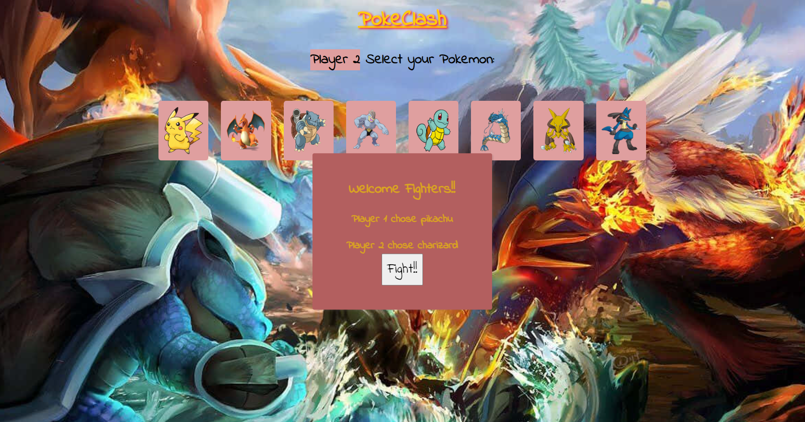
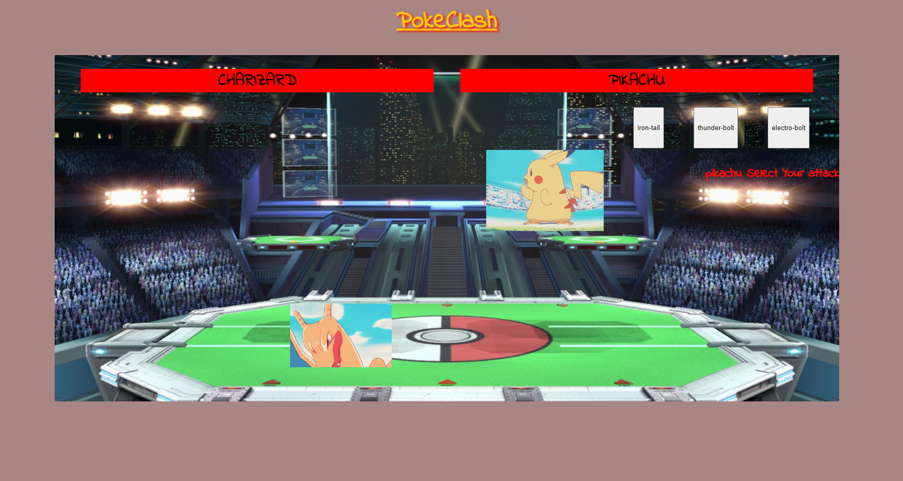
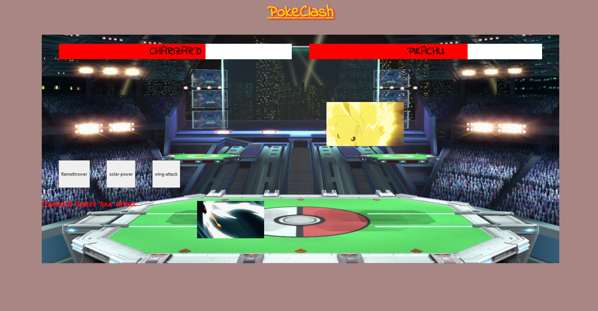
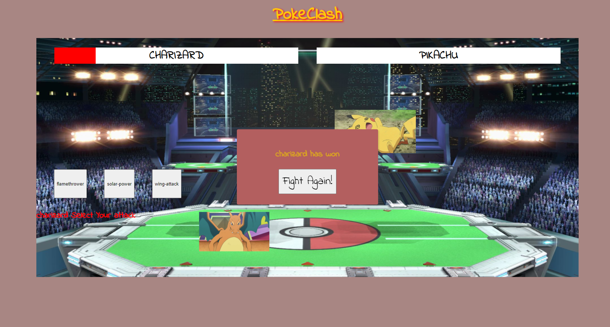

<h1>PokeClash</h1>

PokeClash is an interactive two-player battle game. Two players select a Pokémon and battle until one emerges victorious.

<h2>Screenshot(s)</h2>

<h2>Technologies used</h2>
<ul>
    <li>HTML</li>
    <li>CSS</li>
    <li>JavaScript</li>
  </ul>

<h2>Getting Started</h2>
<h3>Link to project :<a href="https://jefreyzavala1.github.io/unit-1-project/"> PokeClash</a></h3>

<h2>Next Steps</h2>
<ul>
    <li>Add more animations and visual effects.</li>
    <li>Leaderboard table.</li>
    <li>Include background music and attack sound effects.</li>
<ul>
<h2>WireFrame & PseudoCode</h2>
<a href="https://codesandbox.io/s/wireframe-l7mhdw?file=/index.html">link</a>